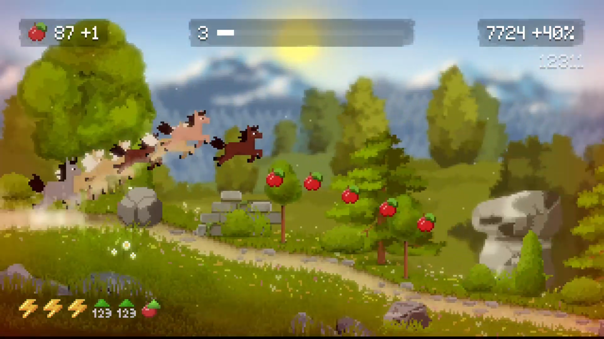
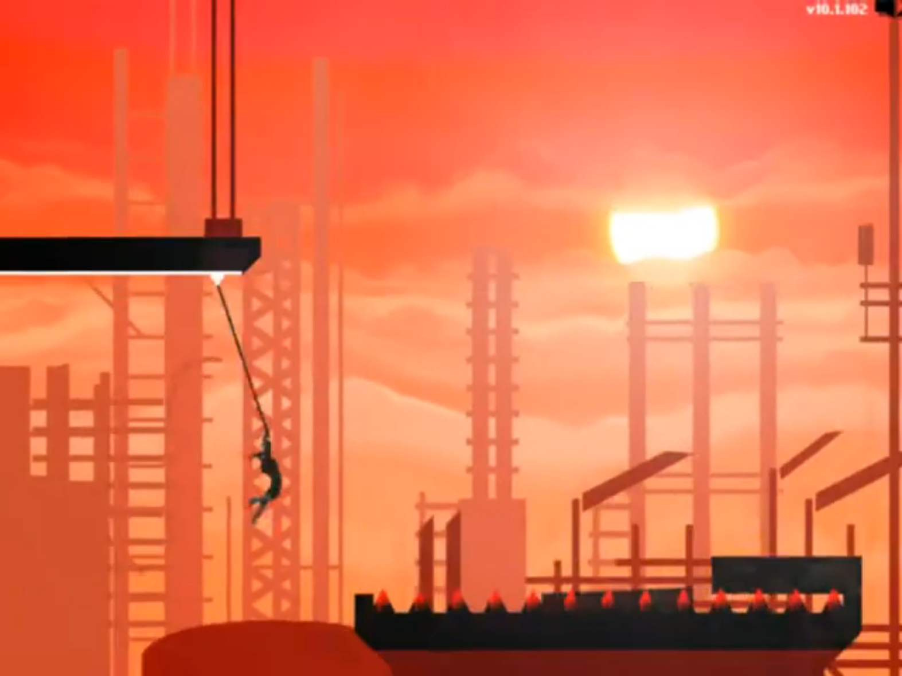
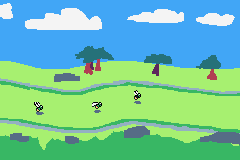
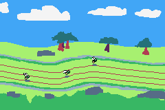
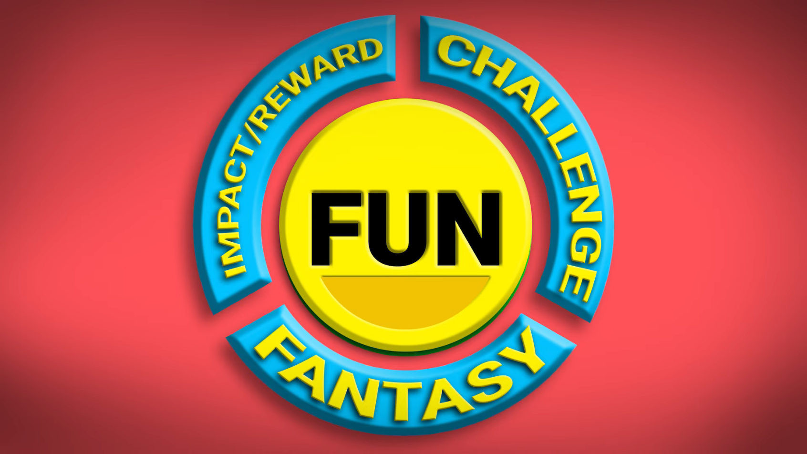

<!--
SPDX-FileCopyrightText: 2026 Kalle Fagerberg
SPDX-FileCopyrightText: 2026 JusJuice

SPDX-License-Identifier: CC0-1.0
-->

# Ideas after the gamejam

What worked

1. shop was fun

What didn't work

1. firefly selection in the "field" is bad

2. the racing in this game is boring

3. design doesn't support multiplayer that well

4. takes too long to get into a race. Too many steps. Should be more "arcade friendly"

5. planning for multiple challenge types was such a dreamy big scope for a gamejam. The game should try to only pick 1 thing and be good at that first and foremost, which for this game should be the racing.

## Racing is boring

Idea: have a "impossible game" / "chrome no internet game" inspired race instead

- Take inspiration from "[Horse Runner DX](https://store.steampowered.com/app/2955320/Horse_Runner_DX/)"
  

- More interactive

- Boosts and abilities come in handy

- Can use some "blue shell" mechanics

- Figure out some abilities to use the touchpad with
  
  - Maybe use a more 2-dimensional map, like SpeedRunners

## New racing design

Firefly is always moving to the right

### Questions

- What does the playing field look like? Is the player (the firefly) close to the ground?
  
  - 
  
  - Close to the ground, same as before
  
  - Only moving left-to-right (can't reverse)

- How to make multiple players visible at the same time
  
  - Each move on a lane horizontally. When the map curves, the lane's path curves too
  
  - Player can't freely move vertically. They only move vertically when the map bends vertically
  
  - 
  
  - (The red lines in the image above wouldn't necessarily be visible in-game. Just for demonstration of the lane paths they follow)

- Can you have multiple fireflies following, like in "Horse Runner DX"?
  
  - Let's not, as we have limited resources and it could get too noisy

- What are the controls?
  
  - Firefly moves to the right on its own
  
  - Player can chose to jump over obstacles
  
  - Sprint (short speed boost, like nitro in car games)
    
    - Doesn't refill by itself. Pickups or other actions fills it up
  
  - Switch lane up or down
    
    - Do this by pointing up/down on the touch pad and pressing jump, and the firefly will then jump to that lane
    - Do this to avoid obstacles or to get behind another player

- What is the primary goal?
  
  - Reach the finish line first

- What is the secondary goal?
  
  - Collect extra points
    
    - Jumping over rocks
    
    - Go through special hoops that gives a few points and small speedup
    
    - Points give you more cash to use on your firefly
  
  - Pickups
    
    - You eat the pickups (snails/worms on the road)
    
    - Temporarily increase sprint duration

- What are the obstacles?
  
  - Water traps that slows you down
  
  - Rocks/logs in the way that briefly stun you
  
  - Different map biomes have different obstacles

- Are the fireflies different?
  
  - (as-in: does the firefly "speed" and "nimbleness" play a role?)
  
  - Speed = speed
  
  - Nimbleness = how fast you jump & switch lane, and how fast you get to top speed at start of game and after hitting an obstacle (i.e acceleration)
  
  - Stamina (new) = how long you can sprint, and perhaps worse stamina means you slow down a little after using sprint
  
  - Vision (new) = how far ahead you can see (beneficial when in 1st place, does nothing when you're in last place)

- How to impact other players?
  
  - No direct impact, except for stressing out your other players
  
  - Other ideas to experiment with:
    
    - Maybe does a small fart when you use your sprint which slows down players behind you on the same lane
    
    - Maybe add abilities from pickups (e.g drop bananas, bullet-bill)
    
    - Maybe add collisions, so you can't just race past someone but you have to overtake using a different lane. Meaning you can also block someone from overtaking you

- What kinds of blue-shells exists?
  
  - (as in, "blue shell" from Mario Cart, to punish people who are in the lead)
  - Following another player fills up your sprint stamina (aka "drafting" in racing games)
    - Must be close behind in the same lane
  - Less vision in front when you're in 1st place. Camera gives lots of vision when you're in last place.
    - Less time to react for dodging obstacles
    - When you're in 2nd place and is closing up on the player in 1st place, then the camera slowly starts moving to the left to reveal less. Up until you're in 1st place and then you get the "1st place vision".
    - Maximum vision for everyone in the beginning of each race

### Jonas Tyroller's model for "fun"

Source: <https://www.youtube.com/watch?v=7L1B5YaxxoA>

#### Impact/reward

- You control the firefly

- Your actions make you get ahead in the race

- Feedback when clearing an obstacle (+10 score)

- Big reward when finishing the race

#### Challenge

* Compete against other fireflies (players and/or AI)

* Racing against other fireflies with different stats ("asymmetrical skirmish")

#### Fantasy

- Fireflies are cute

- Customization
  
  - hats
  
  - different firefly models/"mutations"
